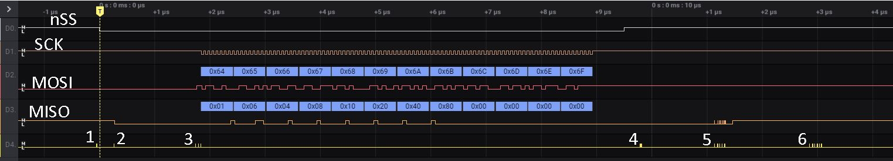

# NUCLEO-F746ZG
This is a repository of example code for the Nucleo board for the STM32F746.
These projects use CubeMX for configuration and the Stm32CubeIde for the IDE.

## NucleoSpiLowLevelLoopBackTest 
This is a project to test SPI DMA operation. DMA is used to reduce CPU cycles for time-critical SPI communications.
SPI3 as a SPI Master is connected to SPI1 as a SPI Slave.
The focus of this exercise is to optimize the SPI Slave side and the SPI master is provides a convenient source signal. 
HAL drivers were used only for initialization but even LL drivers seemed cumbersome so register access is used, using .cpp '&' references to registers.
Software nSS was used assuming that the address is decoded in software.

 

custom_mark10
  digraph G {
    size ="4,4";
    SpiM [shape=box, label="SPI3, Master"];
    SpiS [shape=box, label="SPI1, Slave"];
    SpiM -> SpiS [label="Software controlled nSS, SCK, MOSI, MISO"];
  }
custom_mark10

1. Push button is pressed and nSS is asserted by the SPI master. SCK is 13.9 MHz.
2. SPI Slave ISR handles nSS transition and enables SPI
3. SPI Master completes launch of communications and then lets DMA handle the rest.
4. SPI Master releases nSS upon completion of TX/RX. MISO line tri-states and gradually pulls high
5. SPI Slave stops to process data.
6. SPI Slave gets ready for next TX/RX.
 
